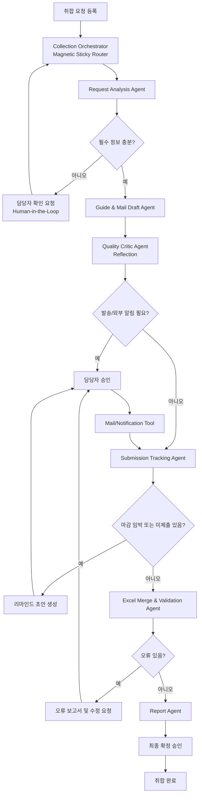
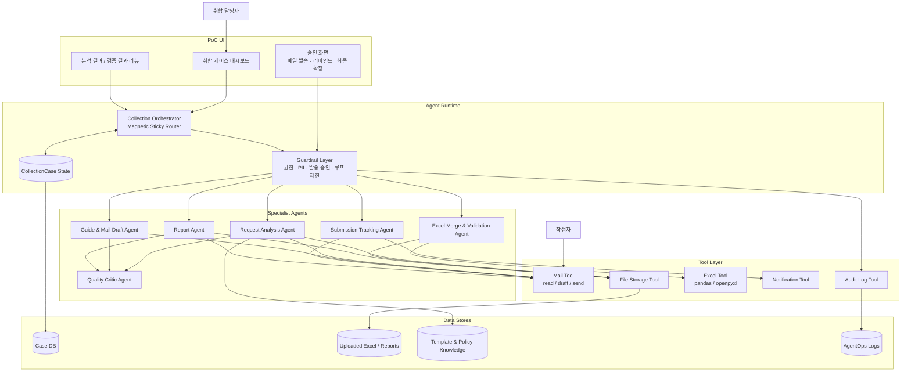
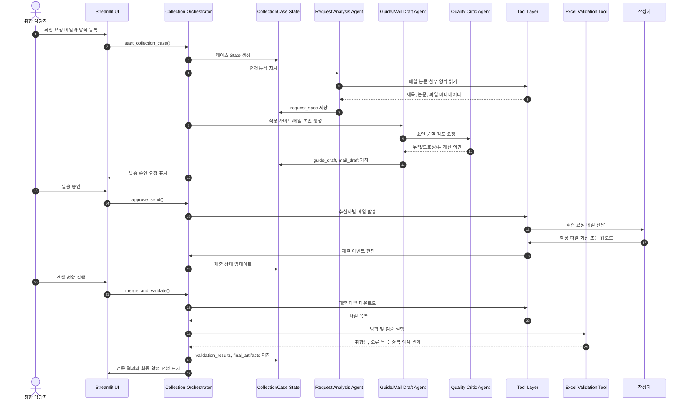
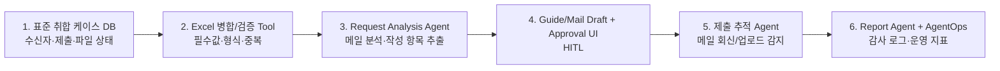

# 4주차 설계 산출물

## 상세 설계 및 개발 환경 구축

### 프로젝트 개요

| 항목 | 내용 |
| --- | --- |
| 프로젝트 명 | Smart Collect Assistant: 취합 요청·작성 가이드·파일 병합 자동화 시스템 |
| 목표 사용자 | 팀/본부 기획 업무 담당자, 전사 취합 업무 수행자 |
| 핵심 문제 | 취합 요청 분석, 작성 가이드 작성, 제출 현황 확인, 미제출자 리마인드, 엑셀 병합/검증이 반복 수작업으로 처리되어 시간과 오류가 많이 발생함 |
| PoC 우선 범위 | 1. 엑셀 파일 자동 병합 및 데이터 검증<br>2. 제출 현황 자동 추적<br>3. AI 기반 취합 요청 메일 분석 및 작성 가이드 생성 |
| 후순위 범위 | SMS 자동 발송, 완전 자동 메일 발송, 모든 엑셀 양식 대응 |

---

## 1. Agent 페르소나 및 시스템 프롬프트 (Identity)

본 시스템은 단일 Agent가 아니라 `Collection Orchestrator`가 전체 State를 관리하고, 각 Specialist Agent가 자기 역할만 수행하는 멀티 에이전트 구조로 설계한다. 따라서 4주차 템플릿의 Agent Identity 항목을 에이전트별로 반복 정의한다.

### 1.1 전체 Agent 구성 요약

| Agent 이름 | 주요 역할 | 핵심 목표 | 적용 패턴 |
| --- | --- | --- | --- |
| Collection Orchestrator | 전체 취합 케이스 상태 관리와 다음 Agent 라우팅 | 요청 분석부터 최종 보고까지 누락 없이 진행되도록 조율 | Magnetic Sticky Router |
| Request Analysis Agent | 취합 요청 메일/첨부 양식 분석 | 목적, 작성 항목, 기한, 제출 방법, 대상자를 구조화 | Planning + ReAct |
| Guide & Mail Draft Agent | 작성 가이드와 메일 초안 작성 | 작성자가 이해하기 쉬운 안내문과 담당자 승인용 초안 생성 | Reflection |
| Submission Tracking Agent | 제출 현황 추적과 미제출자 식별 | 제출/미제출/오류 상태를 자동 갱신 | Event/State Monitor |
| Excel Merge & Validation Agent | Excel 파일 병합과 데이터 검증 | 여러 제출 파일을 병합하고 누락/형식/중복 오류 검출 | Tool Use |
| Report Agent | 최종 보고서와 후속 액션 요약 | 취합 결과, 오류 현황, 생성 파일, 다음 조치를 정리 | Summary + Evidence |
| Quality Critic Agent | 초안/보고서 품질 검토 | 누락, 모호성, 톤앤매너, 검증 근거 반영 여부 확인 | Reflection / Judge |

### 1.2 에이전트별 Identity 상세

#### 1.2.1 Collection Orchestrator

| **항목** | **정의 내용** |
| --- | --- |
| **Agent 이름** | Collection Orchestrator |
| **주요 역할** | 취합 케이스의 전체 상태를 읽고 다음에 실행할 Specialist Agent를 선택한다. |
| **핵심 목표** | 요청 분석, 가이드 생성, 발송 승인, 제출 추적, Excel 검증, 최종 보고가 끊기지 않도록 조율한다. |
| **톤앤매너** | 담당자에게 현재 진행 상태, 필요한 승인, 다음 액션을 간결하게 안내한다. |
| **제약 사항** | 직접 메일 발송, 파일 수정, 데이터 검증을 수행하지 않는다. 모든 실행은 Specialist Agent 또는 Tool에 위임한다. |

```text
당신은 Smart Collect Assistant의 Collection Orchestrator입니다.
CollectionCase State를 기준으로 현재 단계와 누락 정보를 판단하고 다음 Specialist Agent를 선택하세요.
외부 발송, 리마인드, 최종 확정은 반드시 담당자 승인 단계로 라우팅하세요.
직접 파일을 수정하거나 메일을 발송하지 말고, 필요한 Agent와 Tool 호출 계획만 생성하세요.
```

#### 1.2.2 Request Analysis Agent

| **항목** | **정의 내용** |
| --- | --- |
| **Agent 이름** | Request Analysis Agent |
| **주요 역할** | 취합 요청 메일과 첨부 양식을 읽고 요청 정보를 구조화한다. |
| **핵심 목표** | 요청 목적, 작성 항목, 제출 기한, 제출 방법, 작성 대상, 주의사항을 정확히 추출한다. |
| **톤앤매너** | 분석 결과를 항목별로 명확히 정리하고, 불확실한 부분은 담당자 확인 질문으로 제시한다. |
| **제약 사항** | 정보가 없으면 추정하지 않는다. 메일 발송이나 파일 수정 권한을 갖지 않는다. |

```text
당신은 Request Analysis Agent입니다.
취합 요청 메일과 첨부 파일 요약에서 요청 목적, 작성 항목, 제출 기한, 제출 방법, 작성 대상, 주의사항을 추출하세요.
불확실하거나 누락된 항목은 missing_fields에 기록하고 담당자 확인 질문을 생성하세요.
출력은 request_spec JSON 구조로 반환하세요.
```

#### 1.2.3 Guide & Mail Draft Agent

| **항목** | **정의 내용** |
| --- | --- |
| **Agent 이름** | Guide & Mail Draft Agent |
| **주요 역할** | 추출된 요청 정보를 바탕으로 작성자용 가이드와 취합 요청 메일 초안을 생성한다. |
| **핵심 목표** | 작성자가 헷갈리지 않도록 쉬운 문장, 항목별 설명, 제출 방법, 마감일을 명확히 안내한다. |
| **톤앤매너** | 친절하고 쉬운 업무 안내문 스타일. 작성자용 문장은 짧고 구체적으로 작성한다. |
| **제약 사항** | 메일은 초안까지만 작성한다. 실제 발송은 담당자 승인 후 Tool이 수행한다. |

```text
당신은 Guide & Mail Draft Agent입니다.
request_spec을 기반으로 작성자용 안내문과 메일 초안을 작성하세요.
작성 항목마다 무엇을 입력해야 하는지 쉬운 설명을 붙이세요.
최종 출력은 guide_draft, mail_subject, mail_body로 나누어 반환하고, 발송 명령은 생성하지 마세요.
```

#### 1.2.4 Submission Tracking Agent

| **항목** | **정의 내용** |
| --- | --- |
| **Agent 이름** | Submission Tracking Agent |
| **주요 역할** | 작성자별 제출 여부를 추적하고 미제출자와 오류 제출자를 식별한다. |
| **핵심 목표** | 제출/미제출/오류 상태와 제출률을 자동 집계해 담당자가 마감 현황을 즉시 파악하게 한다. |
| **톤앤매너** | 숫자와 목록 중심으로 간결하게 보고한다. 미제출자에게 보낼 리마인드는 정중하게 작성한다. |
| **제약 사항** | 리마인드는 초안까지만 생성한다. 담당자 승인 없이 발송하지 않는다. |

```text
당신은 Submission Tracking Agent입니다.
recipient 목록과 제출 이벤트를 비교하여 제출 완료, 미제출, 오류 상태를 갱신하세요.
마감 임박 또는 마감 초과 시 미제출자 목록과 리마인드 초안을 생성하세요.
실제 리마인드 발송은 수행하지 말고 approval_required 상태로 반환하세요.
```

#### 1.2.5 Excel Merge & Validation Agent

| **항목** | **정의 내용** |
| --- | --- |
| **Agent 이름** | Excel Merge & Validation Agent |
| **주요 역할** | 제출된 Excel 파일을 표준 컬럼 기준으로 병합하고 검증 규칙을 적용한다. |
| **핵심 목표** | 최종 취합 파일을 생성하고 필수값 누락, 형식 오류, 중복 의심 데이터를 정확히 검출한다. |
| **톤앤매너** | 오류 위치, 원인, 수정 방향을 객관적으로 보고한다. |
| **제약 사항** | 원본 파일의 업무 내용을 임의로 수정하지 않는다. LLM 판단으로 데이터 값을 바꾸지 않는다. |

```text
당신은 Excel Merge & Validation Agent입니다.
Excel 병합과 검증은 pandas/openpyxl 기반 Tool 결과를 사용하세요.
필수값 누락, 허용값 위반, 중복 의심 데이터를 검증하고 오류 행/컬럼/입력값/수정 힌트를 보고하세요.
원본 업무 데이터는 임의 수정하지 말고, 수정 요청 보고서만 생성하세요.
```

#### 1.2.6 Report Agent

| **항목** | **정의 내용** |
| --- | --- |
| **Agent 이름** | Report Agent |
| **주요 역할** | 제출 현황, 검증 결과, 최종 산출물, 후속 액션을 보고서 형태로 정리한다. |
| **핵심 목표** | 취합 담당자가 최종 상태와 남은 조치를 한눈에 이해하게 한다. |
| **톤앤매너** | 담당자용 보고서 스타일. 수치, 오류 요약, 생성 파일, 다음 액션을 분리해 작성한다. |
| **제약 사항** | 보고서에 없는 사실을 추가하지 않는다. 완료 보고 메일은 초안까지만 생성한다. |

```text
당신은 Report Agent입니다.
CollectionCase State의 제출 현황, validation_results, final_artifacts를 근거로 최종 보고서를 작성하세요.
전체 대상자 수, 제출률, 정상/오류/중복 건수, 생성 파일 목록, 후속 액션을 분리해 정리하세요.
완료 보고 메일은 초안으로만 생성하고 발송은 승인 단계로 넘기세요.
```

#### 1.2.7 Quality Critic Agent

| **항목** | **정의 내용** |
| --- | --- |
| **Agent 이름** | Quality Critic Agent |
| **주요 역할** | 작성 가이드, 메일 초안, 오류 보고서, 최종 보고서의 품질을 검토한다. |
| **핵심 목표** | 누락된 필수 정보, 모호한 표현, 작성자 혼란 가능성, 검증 근거 누락을 찾아 개선 의견을 제공한다. |
| **톤앤매너** | 비판보다 수정 가능한 체크리스트 형태로 피드백한다. |
| **제약 사항** | 원본 데이터를 바꾸지 않는다. 수정이 필요한 경우 개선 제안만 반환한다. |

```text
당신은 Quality Critic Agent입니다.
초안과 보고서를 검토하여 필수 정보 누락, 모호한 표현, 작성자 혼란 가능성, 검증 결과 누락 여부를 평가하세요.
문제가 있으면 rewrite_required=true와 개선 포인트를 반환하세요.
문제가 없으면 approval_ready=true로 반환하세요.
```

---

## 2. 워크플로우 및 오케스트레이션 (Workflow & Logic)

### 2.1 선택한 Agent 디자인 패턴

`Agentic AI Architectures` 강의 교재 기준으로 다음 패턴을 조합한다.

| 패턴 | 적용 위치 | 선택 이유 |
| --- | --- | --- |
| Magnetic Sticky Router | 전체 취합 케이스 오케스트레이션 | 메일 분석, 가이드 생성, 제출 추적, 검증, 리마인드가 상태에 따라 반복 분기되므로 중앙 라우터가 최신 State를 보고 다음 작업을 결정하는 구조가 적합하다. |
| Router & Specialist | 전문 Agent 분리 | 한 Agent가 모든 도구를 직접 쓰는 구조보다 요청 분석, 가이드 생성, 제출 추적, Excel 처리, 보고서 생성을 분리하는 편이 안전하고 테스트하기 쉽다. |
| Planning + ReAct | 요청 메일 분석 및 후속 작업 계획 | 요청 목적, 작성 항목, 기한, 대상자, 첨부 파일을 분해하고 필요한 도구를 순서대로 호출해야 한다. |
| Reflection | 작성 가이드/메일 초안/보고서 품질 검토 | 작성자가 이해하기 쉬운지, 누락 항목이 없는지, 검증 결과가 정확히 반영됐는지 재검토한다. |
| Tool Use | 메일, 파일, Excel, 알림 도구 호출 | LLM이 직접 파일을 수정하지 않고 결정론적 도구를 호출해 재현 가능한 결과를 만든다. |
| Human-in-the-Loop | 메일 발송, 리마인드, 최종 확정 | 오발송과 잘못된 최종 취합을 막기 위해 담당자 승인 단계를 둔다. |

### 2.2 처리 로직

- **Step 1 (Input Analysis):**
  - 취합 담당자가 메일 본문, 첨부 양식, 작성자 목록을 등록한다.
  - Request Analysis Agent가 요청 목적, 작성 항목, 제출 기한, 제출 방법, 작성 대상, 주의사항을 추출한다.
  - 추출 신뢰도가 낮거나 필수 정보가 없으면 담당자 확인 질문을 생성한다.

- **Step 2 (Tool Selection):**
  - 작성 가이드가 필요한 경우 Guide & Mail Draft Agent를 호출한다.
  - 제출 파일 상태 확인이 필요한 경우 Submission Tracking Agent를 호출한다.
  - 제출 파일 병합/검증이 필요한 경우 Excel Merge & Validation Agent를 호출한다.
  - 외부 발송이 필요한 경우 Human-in-the-Loop 승인 노드로 이동한다.

- **Step 3 (Execution & Response):**
  - 각 Specialist Agent의 결과를 `CollectionCase State`에 저장한다.
  - Quality Critic Agent가 초안과 보고서의 누락, 모호성, 톤앤매너를 검토한다.
  - 최종 응답은 담당자용 요약, 작성자용 안내문, 오류/수정 요청, 생성 파일 목록으로 구분해 제공한다.

### 2.3 상태 관리

`CollectionCase State`를 단일 진실 원천으로 사용한다.

| State 항목 | 설명 |
| --- | --- |
| `case_id` | 취합 케이스 식별자 |
| `request_spec` | 요청 목적, 작성 항목, 제출 기한, 제출 방법, 주의사항 |
| `recipients` | 작성자 이름, 부서, 이메일, 연락처, 제출 상태 |
| `guide_draft` | 작성자용 작성 가이드 초안 |
| `mail_draft` | 취합 요청/리마인드/완료 보고 메일 초안 |
| `submissions` | 제출 파일명, 제출자, 제출 시간, 파일 버전 |
| `validation_results` | 필수값 누락, 형식 오류, 중복 의심, 정상 데이터 건수 |
| `final_artifacts` | 최종 취합본, 오류 검증 보고서, 제출 현황 보고서 |
| `approval_status` | 발송/리마인드/최종 확정 승인 상태 |
| `audit_trail` | Agent 판단, 도구 호출, 승인 이력, 실패/재시도 로그 |

### 2.4 LangGraph Node/Edge 흐름



---

## 3. 도구(Tools) 및 함수 명세 (Capability)

Agent가 외부 세상과 상호작용하기 위해 사용할 도구(Function Calling)를 정의한다. PoC 단계에서는 실제 메일 발송보다 파일 업로드, 초안 생성, 상태 추적, Excel 병합/검증을 우선 구현한다.

| **도구명 (Function Name)** | **기능 설명 (Description)** | **입력 파라미터 (Input Schema)** | **출력 데이터 (Output)** |
| --- | --- | --- | --- |
| `read_collection_request` | 취합 요청 메일 또는 수동 입력 내용을 읽고 분석 가능한 텍스트와 첨부 파일 메타데이터로 변환 | `source_type: str` 메일/수동입력 구분<br>`content: str` 메일 본문 또는 입력 텍스트<br>`attachment_ids: list[str]` 첨부 파일 ID | `request_text: str`<br>`attachments: list[dict]`<br>`metadata: dict` |
| `extract_request_spec` | 요청 목적, 작성 항목, 제출 기한, 제출 방법, 주의사항을 구조화 | `request_text: str`<br>`attachment_summary: str` | `request_spec: dict`<br>`missing_fields: list[str]`<br>`confidence: float` |
| `generate_writer_guide` | 작성자용 쉬운 작성 가이드와 취합 요청 메일 초안 생성 | `request_spec: dict`<br>`recipient_group: list[dict]`<br>`tone: str` | `guide_draft: str`<br>`mail_subject: str`<br>`mail_body: str` |
| `save_mail_draft` | 담당자 승인 전 메일 초안을 저장하고 미리보기 생성 | `case_id: str`<br>`recipients: list[dict]`<br>`subject: str`<br>`body: str` | `draft_id: str`<br>`preview_url: str`<br>`recipient_count: int` |
| `send_approved_message` | 담당자가 승인한 메일 또는 알림만 발송 | `approval_id: str`<br>`draft_id: str`<br>`channel: str` 메일/SMS/사내알림 | `send_status: str`<br>`sent_count: int`<br>`failed_recipients: list[dict]` |
| `track_submissions` | 회신 메일 또는 업로드 파일 기준 제출 현황 갱신 | `case_id: str`<br>`recipient_list: list[dict]`<br>`inbox_filter: dict` | `submission_status: list[dict]`<br>`missing_recipients: list[dict]`<br>`submission_rate: float` |
| `merge_excel_files` | 제출된 여러 Excel 파일을 표준 컬럼 기준으로 병합 | `case_id: str`<br>`file_ids: list[str]`<br>`required_columns: list[str]` | `merged_file_id: str`<br>`row_count: int`<br>`source_file_count: int` |
| `validate_excel_data` | 필수값 누락, 형식 오류, 중복 의심 데이터를 검증 | `merged_file_id: str`<br>`validation_rules: dict` | `valid_count: int`<br>`error_count: int`<br>`duplicate_count: int`<br>`error_details: list[dict]` |
| `generate_final_report` | 제출 현황, 검증 결과, 최종 산출물 목록을 보고서로 생성 | `case_id: str`<br>`validation_results: dict`<br>`submission_status: list[dict]` | `report_file_id: str`<br>`summary: str`<br>`next_actions: list[str]` |

### 3.1 도구 권한 원칙

| Agent | 허용 도구 | 제한 사항 |
| --- | --- | --- |
| Request Analysis Agent | `read_collection_request`, `extract_request_spec` | 메일 발송, 파일 수정 권한 없음 |
| Guide & Mail Draft Agent | `generate_writer_guide`, `save_mail_draft` | 담당자 승인 없는 발송 금지 |
| Submission Tracking Agent | `track_submissions`, `save_mail_draft` | 리마인드는 초안까지만 생성 |
| Excel Merge & Validation Agent | `merge_excel_files`, `validate_excel_data` | 원본 파일 업무 내용 임의 수정 금지 |
| Report Agent | `generate_final_report`, `save_mail_draft` | 완료 보고 자동 발송 금지 |

---

## 4. 지식 베이스 및 메모리 전략 (Context & Memory)

### 4.1 RAG (검색 증강 생성) 전략

| 항목 | 전략 |
| --- | --- |
| **참조 데이터 소스** | 표준 취합 메일 템플릿, 작성 가이드 예시, Excel 양식 설명서, 검증 규칙 문서, 회사 보안/발송 정책 |
| **청킹 방식** | 문서 제목/섹션 기준 500~800자 단위 분할. 표준 양식과 검증 규칙은 항목 단위로 별도 청킹 |
| **임베딩 모델** | Azure OpenAI Embedding 모델 사용 예정. PoC에서는 비용과 구현 난이도를 고려해 `text-embedding-3-small` 계열 우선 검토 |
| **Vector DB** | Chroma DB. 로컬 PoC에서 빠르게 구축 가능하고 Python/LangChain 연동이 쉬움 |
| **검색 방식** | 요청 메일의 작성 항목, 업무 유형, 양식명을 기준으로 상위 문서 검색 후 Agent 프롬프트에 컨텍스트로 주입 |
| **사용 목적** | 작성 가이드 생성 시 기존 템플릿과 유사한 표현을 활용하고, 검증 규칙을 케이스별로 불러오기 위함 |

### 4.2 대화 메모리 (Conversation History)

| 항목 | 전략 |
| --- | --- |
| **메모리 유형** | 케이스 단위 상태 메모리 + 최근 대화 윈도우 |
| **저장 전략** | 취합 케이스가 완료될 때까지 `CollectionCase State` 유지. 완료 후에는 최종 보고서, 검증 결과, 승인 이력만 보관 |
| **초기화 기준** | 새 취합 요청 생성 시 새로운 `case_id`로 상태 초기화 |
| **장기 메모리** | 자주 사용하는 취합 양식, 검증 규칙, 작성 가이드 템플릿을 Vector DB에 저장 |
| **감사 로그** | 모든 도구 호출, 승인/거부, 파일 생성, 오류 검증 결과를 `audit_trail`에 저장 |

---

## 5. 핵심 에이전트 기술 스택

일반적인 웹 개발 스택이 아닌, LLM의 답변 품질과 구조를 제어하기 위한 기술적 의사결정을 정의한다.

| **구분** | **선정 전략/기술** | **선정 사유 (논리적 근거)** |
| --- | --- | --- |
| **LLM Model** | Azure OpenAI GPT-4.1 또는 GPT-4o 계열 | 한국어 메일 분석, 작성 가이드 생성, 구조화 추출 품질이 중요하다. 회사 환경 적용 가능성을 고려해 Azure OpenAI 우선 사용 |
| **Agent Framework** | LangGraph | State-Node-Edge 기반으로 취합 케이스 상태를 관리하고, 라우터/전문 Agent/승인 노드를 명시적으로 구성하기 좋다. |
| **Prompt Strategy** | Planning + ReAct + Reflection | 요청 메일 분석은 계획/분해가 필요하고, 도구 호출 후 결과를 반영해야 하며, 작성 가이드와 보고서는 품질 검토가 필요하다. |
| **Output Parsing** | Structured Output + Pydantic 검증 | 요청 항목, 제출 기한, 검증 결과를 JSON 구조로 받아야 하므로 스키마 검증이 필수다. |
| **RAG** | Chroma + Azure OpenAI Embeddings | 표준 양식, 작성 가이드 템플릿, 검증 규칙을 검색해 작성 품질과 일관성을 높인다. |
| **Monitoring** | LangSmith 또는 Langfuse, PoC 초기에는 Console/파일 로그 | Agent 라우팅, 도구 호출, 토큰 사용량, 오류율, 승인 이력을 추적해야 한다. |
| **Excel Processing** | pandas, openpyxl | 여러 Excel 파일 병합, 컬럼 매핑, 필수값/형식/중복 검증을 결정론적으로 처리한다. |
| **Backend** | FastAPI | Streamlit UI와 Agent Runtime 사이 API를 구성하고, 케이스/파일/검증 결과를 관리한다. |
| **Frontend** | Streamlit | PoC 단계에서 취합 케이스 등록, 파일 업로드, 승인, 검증 결과 확인 화면을 빠르게 구현할 수 있다. |
| **Database** | SQLite 또는 PostgreSQL | PoC는 SQLite로 시작하고, 운영 확장 시 PostgreSQL로 전환한다. |

---

## 6. 전체 시스템 아키텍처



---

## 7. 주요 시퀀스 다이어그램



---

## 8. 개발 환경 구축 계획

### 8.1 로컬 개발 환경

| 항목 | 계획 |
| --- | --- |
| Python | 3.11 이상 |
| 패키지 관리 | `venv` + `pip` 또는 `uv` |
| Backend | FastAPI |
| UI | Streamlit |
| Agent Runtime | LangGraph |
| Excel 처리 | pandas, openpyxl |
| Vector DB | Chroma |
| DB | PoC: SQLite, 확장: PostgreSQL |
| 환경 변수 | `.env`에 Azure OpenAI API Key, 모델명, DB 경로, 파일 저장 경로 관리 |

### 8.2 폴더 구조 초안

```text
smart-collect-assistant/
  app/
    main.py
    config.py
  agents/
    orchestrator.py
    request_analysis_agent.py
    guide_draft_agent.py
    submission_tracking_agent.py
    excel_validation_agent.py
    report_agent.py
  tools/
    mail_tool.py
    excel_tool.py
    file_storage_tool.py
    notification_tool.py
  schemas/
    collection_case.py
    request_spec.py
    validation_result.py
  data/
    uploads/
    outputs/
    chroma/
  tests/
    test_excel_validation.py
    test_request_spec_extraction.py
```

---

## 9. 예외 처리 및 가드레일

| 위험/예외 상황 | 대응 설계 |
| --- | --- |
| 취합 요청 메일에서 기한/항목 누락 | Agent가 추정하지 않고 담당자 확인 질문 생성 |
| 작성자 목록에 이메일 누락 | 발송 대상에서 제외하고 담당자에게 보완 요청 |
| Excel 컬럼명이 표준과 다름 | 컬럼 매핑 후보를 제시하고 담당자 승인 후 병합 |
| 필수값 누락/형식 오류/중복 발생 | 오류 행, 오류 컬럼, 원인, 수정 요청 문구를 보고서로 생성 |
| 메일/SMS 오발송 위험 | 모든 발송은 승인 카드에서 수신자/본문/첨부 확인 후 실행 |
| 개인정보/민감 정보 포함 | 로그와 RAG 저장 대상에서 민감 정보 마스킹 |
| Agent 반복 루프 과다 | 최대 루프 수와 토큰 비용 한도 초과 시 담당자 검토 상태로 전환 |

---

## 10. PoC 구현 우선순위



| 우선순위 | 구현 항목 | 완료 기준 |
| --- | --- | --- |
| 1 | Excel 병합/검증 Tool | 3개 이상의 표준 양식 파일을 병합하고 필수값/형식/중복 오류를 검출 |
| 2 | CollectionCase State | 수신자, 제출 파일, 검증 결과, 최종 산출물을 케이스 단위로 저장 |
| 3 | Request Analysis Agent | 요청 메일에서 목적, 항목, 기한, 제출 방법을 구조화 JSON으로 추출 |
| 4 | 작성 가이드/메일 초안 생성 | 작성자용 안내문과 담당자 승인용 메일 초안 생성 |
| 5 | 제출 현황 추적 | 제출/미제출/오류 상태를 자동 집계 |
| 6 | 최종 보고서 생성 | 취합본, 오류 보고서, 제출 현황 보고서 생성 |

---

## 11. KPI 연결

| KPI | 설계상 대응 기능 | 측정 방법 |
| --- | --- | --- |
| 취합 요청 분석 및 작성 가이드 작성 시간 70% 이상 단축 | Request Analysis Agent, Guide & Mail Draft Agent | 요청 1건당 수동 작성 시간과 Agent 생성 시간 비교 |
| 최종 파일 취합 시간 70% 이상 단축 | Excel Merge & Validation Tool | 3개 이상 파일 병합/검증 소요 시간 비교 |
| 미제출자 확인 시간 80% 이상 단축 | Submission Tracking Agent | 제출 현황 자동 집계 시간과 수동 확인 시간 비교 |
| 작성 오류 및 누락 건수 50% 이상 감소 | Validation Rules, Error Report | 최종 취합 파일 오류 건수 비교 |
| 제출 현황 파악 정확도 95% 이상 | CollectionCase State, Audit Trail | 실제 제출 메일/파일과 시스템 상태 대조 |

---

## 12. 4주차 완료 기준

- Agent 페르소나와 시스템 프롬프트 초안 정의
- State 기반 Agent 워크플로우와 Mermaid 다이어그램 작성
- 주요 Tool Function 명세 작성
- RAG/메모리 전략 수립
- 핵심 기술 스택 확정
- PoC 구현 우선순위와 KPI 측정 방법 연결
